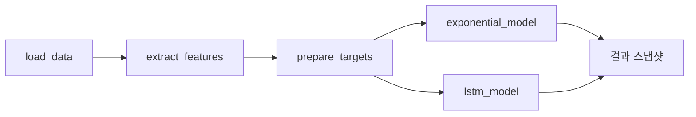

# Wind Turbine Bearing RUL Prediction

풍력 터빈 고속 베어링의 **잔여 수명(RUL)** 을 예측하는 end-to-end 시스템.
실제 MathWorks 베어링 데이터([원본 데모](https://kr.mathworks.com/help/predmaint/ug/wind-turbine-high-speed-bearing-prognosis.html))
를 사용하며, Python ML 파이프라인 · FastAPI 서비스 · React 대시보드가 한 저장소에 함께 있다.

- **ML 코어**: PCA 건강 지표, 지수 열화 모델(delta-method CI), LSTM(데이터 누수 방지 스케일링)
- **API**: FastAPI + BackgroundTasks + in-memory JobRegistry 기반 비동기 파이프라인
- **프론트**: Vite + React + TypeScript + TanStack Query + Plotly
- **재현성**: `seed=42` 고정 시 LSTM MAE **5.016**, Exponential MAE **75.000** 정확 재현

---

## 1. 저장소 구조

```
wind-turbine-rul-prediction/
├── README.md
├── docs/
│   ├── architecture.md            # 시스템 개요·계층·설계 결정
│   └── uml.md                     # 컴포넌트/클래스/시퀀스/상태 다이어그램
│
├── backend/                       # Python 파이프라인 + FastAPI 서비스
│   ├── main.py                    # CLI 진입점 (SimpleRULPipeline)
│   ├── config.py                  # 상수·시드·경로
│   ├── utils.py                   # set_global_seed()
│   ├── data_loader.py             # MathWorks .mat 파일 로드
│   ├── feature_extractor.py       # 특징 추출 / 선택 / PCA
│   ├── models.py                  # Exponential + LSTM 모델
│   ├── visualization.py           # matplotlib 리포트
│   ├── app/                       # FastAPI 레이어
│   │   ├── main.py                # create_app(), /healthz
│   │   ├── core/settings.py
│   │   ├── schemas/pipeline.py    # Pydantic DTO
│   │   ├── services/
│   │   │   ├── job_registry.py    # Job, JobRegistry
│   │   │   └── pipeline_service.py # BackgroundTask 엔트리
│   │   └── api/
│   │       ├── pipelines.py       # POST /run + 4 결과 GET
│   │       └── jobs.py            # GET /jobs/{id}
│   ├── tests/                     # pytest 19건 (ML 14 + API 5)
│   ├── pyproject.toml
│   └── requirements.txt
│
└── frontend/                      # Vite + React + TypeScript SPA
    ├── index.html
    ├── vite.config.ts             # /api, /healthz → :8000 프록시
    ├── package.json
    └── src/
        ├── main.tsx               # QueryClientProvider
        ├── App.tsx
        ├── api/
        │   ├── client.ts          # axios 래퍼
        │   ├── types.ts           # Pydantic DTO 대응 TS 타입
        │   └── schema.ts          # openapi-typescript 생성본
        └── components/
            ├── Dashboard.tsx      # 루트 페이지
            └── PlotlyChart.tsx    # react-plotly.js Suspense 래퍼
```

대용량 경로(`backend/WindTurbineHighSpeedBearingPrognosis-Data-main/`,
`backend/{plots,results,saved_models}/`, `frontend/{node_modules,dist}/`)는 `.gitignore` 처리.

---

## 2. 빠른 시작

### 2.1 백엔드 — CLI 파이프라인

```bash
cd backend
pip install -r requirements.txt   # + pip install tensorflow   (LSTM 사용 시)
python main.py                    # 전체 파이프라인 실행
python main.py --no-lstm          # LSTM 생략
python main.py --no-plot          # 시각화 생략
```

### 2.2 백엔드 — FastAPI 서비스

```bash
cd backend
pip install -e '.[api,lstm]'      # fastapi, uvicorn, python-multipart, tensorflow
uvicorn app.main:app --reload --port 8000
# Swagger UI: http://localhost:8000/docs
```

### 2.3 프론트 — 대시보드

```bash
cd frontend
npm install
npm run dev                       # http://localhost:5173 (→ :8000 프록시)
npm run gen:api                   # openapi-typescript 로 schema.ts 재생성
npm run build                     # 타입체크 + 프로덕션 빌드
```

백엔드·프론트를 각각 다른 셸에서 띄우면 브라우저에서 바로 사용 가능.

### 2.4 테스트

```bash
cd backend
pip install -e '.[dev]'
pytest                            # 19 passed
```

---

## 3. REST API 요약

| Method | Path                                      | 용도                                                |
| :----- | :---------------------------------------- | :-------------------------------------------------- |
| GET    | `/healthz`                                | 헬스 체크                                           |
| POST   | `/api/v1/pipelines/run`                   | 파이프라인 시작 → `{job_id, status}` (202)          |
| GET    | `/api/v1/jobs/{id}`                       | 작업 상태·step·progress·logs 폴링                   |
| GET    | `/api/v1/pipelines/{id}/dataset-summary`  | 샘플 수·기간                                        |
| GET    | `/api/v1/pipelines/{id}/health-indicator` | PCA 첫 주성분 시계열 + threshold                    |
| GET    | `/api/v1/pipelines/{id}/predictions`      | 모델별 `{predictions, targets, sequence_offset}`    |
| GET    | `/api/v1/pipelines/{id}/metrics`          | `mae_days`/`rmse_days`, `best_model`                |

실행 흐름과 상호작용 순서는 [docs/uml.md §4](docs/uml.md) 시퀀스 다이어그램 참고.

---

## 4. 데이터

기본 데이터셋은 MathWorks 공개 저장소에서 최초 실행 시 자동 다운로드됩니다
(`WindTurbineHighSpeedBearingPrognosis-Data-main/*.mat`, 50 파일,
97656 Hz × 6 s × 50 = 약 14.6 M 샘플).

- **진동·타임스탬프**는 전부 실측.
- **타코미터**는 `.mat` 에 누락된 경우에만 파일명 해시 시드 기반으로 합성(파이프라인에서 미사용).
- 다운로드 실패 시 `load_simulated_data()` 가 폴백으로 합성 데이터를 만듦.

---

## 5. 파이프라인 단계 (SimpleRULPipeline)



각 단계는 `JobRegistry` 에 `step`·`progress`·로그를 기록하므로 프론트가 그대로
진행률 바로 표시한다. 상세 워크플로우는 [docs/architecture.md](docs/architecture.md) 참고.

---

## 6. 주요 설계 원칙

- **ML 코어와 API 레이어 분리** — `backend/app/` 은 `backend/*.py` 를 import 하지만
  역방향 의존은 없음. 코어는 CLI·다른 프런트에서 그대로 재사용 가능.
- **재현성 최우선** — `set_global_seed(seed)` 가 `random`·`numpy`·`tensorflow` 시드를 통일
  고정. LSTM 스케일러는 훈련 구간에서만 `fit` 하여 데이터 누수 차단.
- **비동기는 단순하게** — MVP 는 `BackgroundTasks` + 폴링. Celery/SSE 승격 경로는
  `services/pipeline_service.py` 를 swap 하도록 설계.
- **타입 계약** — FastAPI `/openapi.json` → `openapi-typescript` → `src/api/schema.ts`.
  프론트 `types.ts` 는 초기 수동, 필요 시 자동 생성본으로 교체 가능.

---

## 7. 설정 커스터마이징

| 항목 | 파일 | 키 |
| --- | --- | --- |
| LSTM 하이퍼파라미터 | `backend/config.py` | `LSTM_CONFIG` |
| 특징 선택 엄격도 | `backend/config.py` | `MONOTONICITY_THRESHOLD`, `MIN_SELECTED_FEATURES` |
| train/val/test 분할 | `backend/config.py` | `TRAIN_SPLIT`, `VALIDATION_SPLIT` |
| 전역 시드 | `backend/config.py` | `RANDOM_SEED` (or API `seed`) |
| CORS 허용 도메인 | env var | `CORS_ORIGINS` (기본 `localhost:5173`) |

---

## 8. 문서

- [docs/architecture.md](docs/architecture.md) — 시스템 개요, 계층 구조, 런타임 시나리오, 설계 결정, 확장 포인트
- [docs/uml.md](docs/uml.md) — 컴포넌트 / 클래스 / 시퀀스 / 상태 / 의존성 다이어그램

---

## 9. 문제 해결

- **TensorFlow import 실패** — `pip install tensorflow==2.10.*` (py310_tf 환경 기준).
  사용 불가 시 CLI·API 모두 LSTM 단계를 자동 스킵.
- **데이터 다운로드 실패** — 방화벽 등으로 GitHub 접근이 막히면 수동 다운로드 후
  `backend/WindTurbineHighSpeedBearingPrognosis-Data-main/` 에 배치.
- **메모리 부족** — `config.LSTM_CONFIG['batch_size']` 축소, `sequence_length` 감소.
- **한글 폰트 깨짐** — matplotlib 에 `plt.rcParams['font.family'] = 'DejaVu Sans'`.
