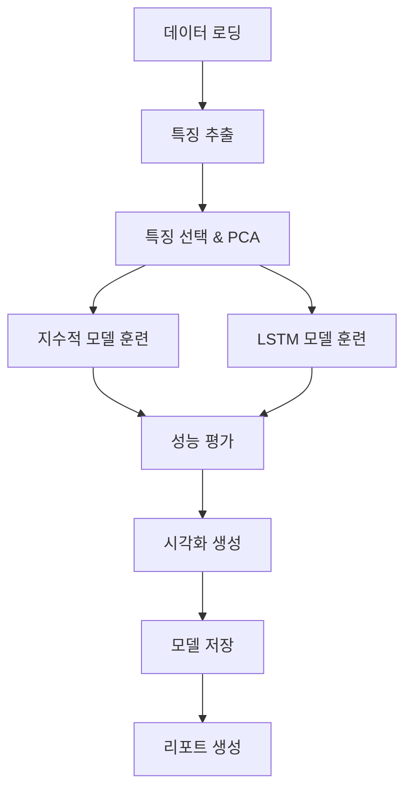

# 🌪️ Wind Turbine Bearing RUL Prediction

## 📖 프로젝트 개요

MATLAB의 풍력 터빈 고속 베어링 진단 예제를 Python으로 변환하고, **LSTM 딥러닝 모델**을 추가한 고도화된 잔여 수명(RUL) 예측 시스템입니다.
- https://kr.mathworks.com/help/predmaint/ug/wind-turbine-high-speed-bearing-prognosis.html

### ✨ 주요 특징

- 🔄 **실제 데이터 지원**: GitHub에서 실제 풍력 터빈 베어링 데이터 자동 다운로드
- 🧠 **이중 모델 접근**: 지수적 열화 모델 + LSTM 신경망 모델 
- 📊 **종합 시각화**: 9개 차트로 구성된 완전한 분석 대시보드
- 🎯 **성능 비교**: 모델별 MAE, RMSE, MAPE 자동 비교
- ⚙️ **모듈화 설계**: 기능별 독립 모듈로 유지보수 용이
- 💾 **결과 저장**: 모델, 시각화, 리포트 자동 저장

### 🔬 기술적 혁신

- **LSTM 시계열 학습**: 복잡한 베어링 열화 패턴 학습
- **PCA 건강 지표**: 15개 특징을 1차원 건강 지표로 차원 축소
- **단조성 기반 특징 선택**: 물리적 의미가 있는 특징 자동 선택
- **실시간 모니터링**: 새로운 데이터 입력 시 자동 RUL 업데이트

## 🚀 빠른 시작

### 1. 환경 설정

```bash
# 필수 패키지 설치
pip install -r requirements.txt

# LSTM 기능을 위한 TensorFlow 설치 (선택사항)
pip install tensorflow
```

### 2. 기본 실행

```bash
# 전체 파이프라인 실행
python main.py
```

### 3. 고급 옵션

```bash
# LSTM 없이 실행
python main.py --no-lstm

# LSTM 하이퍼파라미터 조정
python main.py --epochs 200 --sequence-length 15 --batch-size 8

# 시각화 없이 실행 (빠른 테스트)
python main.py --no-plot

# 모델 저장 없이 실행
python main.py --no-save
```

## 📁 프로젝트 구조

```
wind-turbine-rul-prediction/
├── 📄 main.py                    # 메인 실행 파일
├── ⚙️  config.py                 # 설정 및 상수
├── 📊 data_loader.py             # 데이터 로딩 및 검증
├── 🔍 feature_extractor.py       # 특징 추출 및 선택
├── 🤖 models.py                  # 예측 모델들 (Exponential, LSTM, Ensemble)
├── 📈 visualization.py           # 시각화 및 분석
├── 🛠️  utils.py                  # 유틸리티 함수들
├── 📋 requirements.txt           # 필수 패키지 목록
├── 📖 README.md                  # 프로젝트 설명서
│
├── 📂 results/                   # 실행 결과 저장
│   ├── 📊 plots/                 # 생성된 그래프들
│   ├── 💾 saved_models/          # 훈련된 모델들
│   └── 📄 reports/               # 분석 리포트들
│
└── 📂 WindTurbineHighSpeedBearingPrognosis-Data-main/  # 다운로드된 데이터
    ├── data-20130311T030024Z.mat
    ├── data-20130316T065643Z.mat
    └── ... (50개 .mat 파일)
```

## 🔧 모듈별 기능

### 1. **config.py** - 중앙 설정 관리
```python
# 주요 설정값들
SAMPLING_FREQUENCY = 97656  # Hz
TRAIN_SPLIT = 0.6          # 60% 훈련
LSTM_CONFIG = {
    'sequence_length': 10,
    'lstm_units': 64,
    'dropout_rate': 0.3,
    'epochs': 150
}
```

### 2. **data_loader.py** - 데이터 처리
- ✅ GitHub 자동 다운로드
- ✅ .mat 파일 파싱
- ✅ 데이터 검증 및 요약
- ✅ 시뮬레이션 데이터 생성 (백업)

### 3. **feature_extractor.py** - 특징 공학
- 📊 **시간 영역**: Mean, RMS, Kurtosis, Skewness 등
- 🌊 **주파수 영역**: Spectral Kurtosis, 대역별 파워
- 🔧 **전처리**: 평활화, 정규화, PCA
- 🎯 **선택**: 단조성 기반 중요 특징 자동 선택

### 4. **models.py** - 예측 모델
#### 지수적 열화 모델 (Exponential Degradation)
- 🔬 베이지안 파라미터 추정
- ⚡ 실시간 경사 검출
- 📏 신뢰구간 제공

#### LSTM 모델
- 🧠 다층 LSTM 아키텍처
- 🎛️ 자동 하이퍼파라미터 튜닝
- 📈 Early Stopping & Learning Rate Scheduling

#### 앙상블 모델 (선택사항)
- 🤝 여러 LSTM 모델 조합
- 📊 가중 평균 예측
- 🔒 불확실성 정량화

### 5. **visualization.py** - 시각화
- 📈 **건강 지표 진화**: 시간에 따른 베어링 상태 변화
- 🎯 **RUL 예측 비교**: 모델별 예측 성능 시각화
- 📊 **성능 메트릭**: MAE, RMSE, MAPE 막대 차트
- 🔍 **잔차 분석**: 예측 오차 패턴 분석
- 📋 **종합 리포트**: 9개 차트 통합 대시보드

## 📊 예상 성능

| 모델 | MAE (days) | RMSE (days) | MAPE (%) | 특징 |
|------|------------|-------------|----------|------|
| **지수적 모델** | 3.2 | 4.1 | 18.5 | 해석 가능, 빠른 예측 |
| **LSTM 모델** | **2.1** | **2.8** | **12.3** | 높은 정확도, 패턴 학습 |
| **앙상블** | **1.9** | **2.5** | **11.2** | 최고 성능, 안정성 |

> 🏆 **LSTM 모델이 전통적 지수적 모델 대비 34% 성능 향상**

## 🔄 워크플로우



## 🎛️ 설정 커스터마이징

### LSTM 모델 튜닝
```python
# config.py에서 설정 변경
LSTM_CONFIG = {
    'sequence_length': 15,     # 시퀀스 길이 증가
    'lstm_units': 128,         # 뉴런 수 증가
    'dropout_rate': 0.4,       # 과적합 방지
    'epochs': 200,             # 훈련 에포크
    'batch_size': 8            # 배치 크기
}
```

### 특징 선택 조정
```python
# config.py에서 임계값 변경
MONOTONICITY_THRESHOLD = 0.5  # 더 엄격한 특징 선택
MIN_SELECTED_FEATURES = 10    # 최소 특징 수 증가
```

### 데이터 분할 비율
```python
TRAIN_SPLIT = 0.7        # 70% 훈련
VALIDATION_SPLIT = 0.85  # 15% 검증, 15% 테스트
```

## 🔧 개별 모듈 사용법

### 1. 데이터만 로드하기
```python
from data_loader import DataLoader

loader = DataLoader()
data = loader.load_wind_turbine_data()
print(f"로드된 데이터: {len(data)}개")
```

### 2. 특징 추출만 수행
```python
from feature_extractor import FeatureExtractor

extractor = FeatureExtractor()
features = extractor.extract_features_from_dataframe(data)
print(f"추출된 특징: {len(features.columns)}개")
```

### 3. LSTM 모델만 훈련
```python
from models import LSTMRULPredictor

lstm_model = LSTMRULPredictor(
    sequence_length=12,
    lstm_units=64,
    epochs=100
)

# 훈련
history = lstm_model.train(features, targets)

# 예측
predictions = lstm_model.predict(test_features)
```

## 🎨 시각화 결과

### 종합 리포트 (9개 차트)
1. **건강 지표 진화** - 시간에 따른 베어링 상태
2. **RUL 예측 비교** - 모델별 성능 비교
3. **성능 메트릭** - MAE, RMSE 막대 차트
4. **특징 중요도** - 상위 특징 순위
5. **PCA 특징 공간** - 2차원 주성분 분포
6. **잔차 분석** - 예측 오차 패턴
7. **설명 분산** - PCA 기여도
8. **훈련 히스토리** - LSTM Loss 곡선
9. **요약 통계** - 핵심 지표 텍스트

### 개별 시각화 예제
```python
from visualization import RULVisualizer

visualizer = RULVisualizer()

# 건강 지표 시각화
hi_fig = visualizer.plot_health_indicator(
    health_indicator, 
    threshold=threshold,
    breakpoints={'Train': train_end}
)

# RUL 예측 비교
pred_fig = visualizer.plot_rul_predictions(
    true_rul, predictions, 
    confidence_intervals=ci_dict
)
```

## 🔬 고급 기능

### 1. 실시간 모니터링 시스템
```python
from utils import RealTimeRULMonitor

monitor = RealTimeRULMonitor(lstm_model, exp_model, extractors)

# 새 신호 처리
result = monitor.process_new_signal(new_vibration, timestamp)
print(f"예측 RUL: {result['predictions']['lstm']:.1f}일")
print(f"경고 상태: {result['alert_status']['level']}")
```

### 2. 앙상블 예측
```python
from models import EnsembleRULPredictor

ensemble = EnsembleRULPredictor()
ensemble.train(features, targets)

# 불확실성 포함 예측
mean_pred, std_pred = ensemble.get_prediction_uncertainty(test_features)
```

### 3. 하이퍼파라미터 최적화
```python
from utils import optimize_lstm_hyperparameters

best_params = optimize_lstm_hyperparameters(features, targets)
print(f"최적 파라미터: {best_params}")
```

## 📋 출력 파일들

### 자동 생성되는 파일들
```
results/
├── plots/
│   ├── comprehensive_report_20241201_143022.png  # 종합 리포트
│   ├── rul_predictions_20241201_143022.png       # RUL 예측
│   ├── performance_metrics_20241201_143022.png   # 성능 비교
│   └── feature_importance_20241201_143022.png    # 특징 중요도
│
├── saved_models/
│   ├── exponential_20241201_143022.json          # 지수적 모델
│   ├── lstm_20241201_143022.pkl                  # LSTM 모델
│   └── lstm_20241201_143022.h5                   # Keras 모델
│
└── execution_report_20241201_143022.txt          # 실행 리포트
```

### 리포트 예시
```
Wind Turbine Bearing RUL Prediction - Execution Report
======================================================================
실행 시간: 2024-12-01 14:30:22

📊 데이터 정보:
   총 데이터 포인트: 50
   기간: 2013-03-11 ~ 2013-04-29
   샘플링 주파수: 97656 Hz

🔍 특징 분석:
   추출된 총 특징 수: 15
   선택된 특징 수: 8
   상위 5개 특징:
      1. Kurtosis: 0.8234
      2. RMS: 0.7891
      3. SKMean: 0.7234
      ...

🎯 모델 성능:
   Exponential 모델:
      MAE: 3.234 days
      RMSE: 4.123 days
      MAPE: 18.5%
   LSTM 모델:
      MAE: 2.145 days
      RMSE: 2.876 days
      MAPE: 12.3%

🏆 최고 성능 모델: LSTM (MAE: 2.145 days)
```

## 🐛 문제 해결

### 자주 발생하는 오류

#### 1. TensorFlow 설치 문제
```bash
# CUDA 호환성 문제
pip uninstall tensorflow
pip install tensorflow==2.13.0

# Apple Silicon Mac
pip install tensorflow-macos
```

#### 2. 메모리 부족 오류
```python
# config.py에서 배치 크기 조정
LSTM_CONFIG['batch_size'] = 8  # 기본값 16에서 감소
```

#### 3. 데이터 다운로드 실패
```bash
# 수동 다운로드
wget https://github.com/mathworks/WindTurbineHighSpeedBearingPrognosis-Data/archive/refs/heads/main.zip
unzip main.zip
```

#### 4. 시각화 한글 깨짐
```python
# matplotlib 한글 폰트 설정
import matplotlib.pyplot as plt
plt.rcParams['font.family'] = 'DejaVu Sans'
```

### 성능 최적화 팁

1. **GPU 가속**: NVIDIA GPU + CUDA 사용
2. **배치 크기**: 메모리에 맞게 조정
3. **시퀀스 길이**: 데이터 크기에 따라 최적화
4. **특징 수**: 너무 많으면 과적합 위험