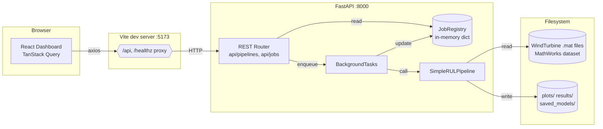

# Architecture — Wind Turbine RUL Prediction

> 작성일: 2026-04-20
> 대상 커밋: `without_dataset` 브랜치 (FastAPI + Vite MVP 완료 시점)

풍력 터빈 고속 베어링의 잔여 수명(RUL) 예측 시스템. ML 파이프라인(Python/TF)을
FastAPI 로 감싸 비동기 작업 큐로 노출하고, Vite + React 대시보드가 이를 소비한다.

---

## 1. 시스템 개요



---

## 2. 계층 구조

### 2.1 Backend — 두 계층

- **ML 코어** (`backend/*.py`) — 프레임워크-무관 순수 파이썬 모듈.
  기존 스크립트에서 성장한 flat layout 을 보존한 채 FastAPI 레이어에서 import.
- **API 레이어** (`backend/app/`) — FastAPI + Pydantic + BackgroundTasks.
  ML 코어를 HTTP 뒤로 감싸는 얇은 어댑터.

```
backend/
├── config.py              # 전역 상수 + ensure_output_dirs()
├── utils.py               # set_global_seed() (numpy/TF/random)
├── data_loader.py         # DataLoader — .mat 파일 로드
├── feature_extractor.py   # FeatureExtractor / FeatureSelector / DimensionReducer
├── models.py              # ExponentialDegradationModel, LSTMRULPredictor
├── main.py                # SimpleRULPipeline (7단계) + CLI entrypoint
├── visualization.py       # RULVisualizer (matplotlib)
│
├── app/                   # FastAPI 레이어
│   ├── main.py            # create_app() — CORS, 라우터 등록, /healthz
│   ├── core/settings.py   # 환경변수 기반 Settings dataclass
│   ├── schemas/pipeline.py  # Pydantic 요청/응답 DTO
│   ├── services/
│   │   ├── job_registry.py    # Job + JobRegistry (thread-safe)
│   │   └── pipeline_service.py # run_pipeline_job — BackgroundTask 엔트리
│   └── api/
│       ├── pipelines.py   # POST /run + 4개 결과 GET
│       └── jobs.py        # GET /jobs/{id}
└── tests/                 # pytest 19개 (ML + API)
```

### 2.2 Frontend — SPA

```
frontend/
├── vite.config.ts         # /api, /healthz → :8000 프록시
├── index.html
└── src/
    ├── main.tsx           # QueryClientProvider 부트스트랩
    ├── App.tsx
    ├── api/
    │   ├── client.ts      # axios 래퍼 (runPipeline, getJobStatus, ...)
    │   ├── types.ts       # Pydantic DTO에 대응하는 TS 타입 (수동)
    │   └── schema.ts      # openapi-typescript 생성본 (npm run gen:api)
    └── components/
        ├── Dashboard.tsx  # 루트 페이지 (RunControls, JobProgress, Results)
        └── PlotlyChart.tsx # react-plotly.js Suspense 래퍼
```

---

## 3. 런타임 시나리오 — "Run pipeline" 흐름

1. 사용자가 대시보드의 `Run pipeline` 버튼 클릭 → `POST /api/v1/pipelines/run`
2. `pipelines.router` 가 `JobRegistry.create()` 로 `Job(id, status="pending")` 생성
3. `BackgroundTasks` 에 `run_pipeline_job(job_id, registry, …)` 등록 후 202 반환
4. 백그라운드 태스크가 `set_global_seed(seed)` → `SimpleRULPipeline` 의 5단계를 순차 실행:
   `load_data → extract_features → prepare_targets → exponential_model → lstm_model`.
   각 단계 전후로 `registry.update(step=…, progress=…/5)` 와 로그 append.
5. 완료 시 `_collect_result()` 가 파이프라인 상태를 JSON-직렬화 가능한 dict 로 스냅샷 → `job.result`
6. 프론트의 `useQuery(["job", jobId], …)` 가 1.5초 간격으로 `GET /jobs/{id}` 폴링.
   상태가 `succeeded`/`failed` 이면 `refetchInterval` 이 `false` 를 반환해 자동 종료
7. 성공하면 4개 결과 엔드포인트 병렬 호출:
   - `/dataset-summary` → 샘플 수·기간
   - `/health-indicator` → PCA 첫 주성분 시계열 + threshold
   - `/predictions` → 모델별 `{predictions, targets, sequence_offset}`
   - `/metrics` → `mae_days`/`rmse_days`, `best_model`

---

## 4. 주요 설계 결정

| 영역 | 결정 | 이유 |
|---|---|---|
| API 프레임워크 | **FastAPI** | Pydantic 자동 Swagger, async, 기존 타입힌트와 정합 |
| 장기 작업 | **BackgroundTasks + 폴링** | 단일 프로세스 MVP. 추후 Celery/Redis 승격 경로 유지 |
| 잡 저장 | **In-memory `JobRegistry`** | 단일 프로세스 전제. swap-in 지점을 services/ 에 격리 |
| 프레임워크 경계 | **ML 코어 ↔ app/ 분리** | 코어는 FastAPI 미의존. 테스트/CLI/다른 프론트에서도 재사용 |
| 재현성 | **`set_global_seed` (seed API 파라미터 노출)** | 같은 입력/시드 → 동일 결과. LSTM MAE 5.016 재현 확인 |
| 프론트 타입 계약 | **수동 `types.ts` + `openapi-typescript`** | 초기에는 수동, CI 에서 schema.ts 로 검증 가능 |
| 상태 관리 | **TanStack Query only** | 서버 캐시 + 폴링이 주 요구. Redux/Zustand 불필요 |
| 차트 | **react-plotly.js (lazy)** | 과학 그래프 최적. Suspense 로 초기 번들 분리 |
| 스타일링 | **Tailwind (no shadcn)** | MVP 경량 유지. 필요 시 shadcn 추가 가능 |

---

## 5. 재현성 & 데이터 출처

- 실제 데이터: **MathWorks `WindTurbineHighSpeedBearingPrognosis-Data`**
  (50개 `.mat`, 97656 Hz × 6 s, 2013-03-07 ~ 2013-04-25)
- 타코미터 배열이 누락된 `.mat` 에 한해 파일명 해시 시드 기반으로 합성 (결과에는 미사용)
- `seed=42` 시 결정적 결과: Exp MAE 75.000, LSTM MAE 5.016

---

## 6. 확장 포인트

| 현재 | 다음 단계 | 접점 |
|---|---|---|
| BackgroundTasks | Celery + Redis | `services/pipeline_service.py` 교체, `JobRegistry` swap |
| 폴링 (`GET /jobs/{id}`) | SSE 로그 스트리밍 | 새 라우터 `/jobs/{id}/events` 추가 |
| 내장 데이터셋 고정 | `.mat` / CSV 업로드 | `/datasets` POST + `datasets/` 저장소 |
| in-memory 모델 | 모델 영속화 (SQLite→PG) | `services/model_store.py` 신규 |
| 개발 모드 실행 | (배포는 본 MVP 범위 외) | `docs/tech-review.md` §6 참조 |
