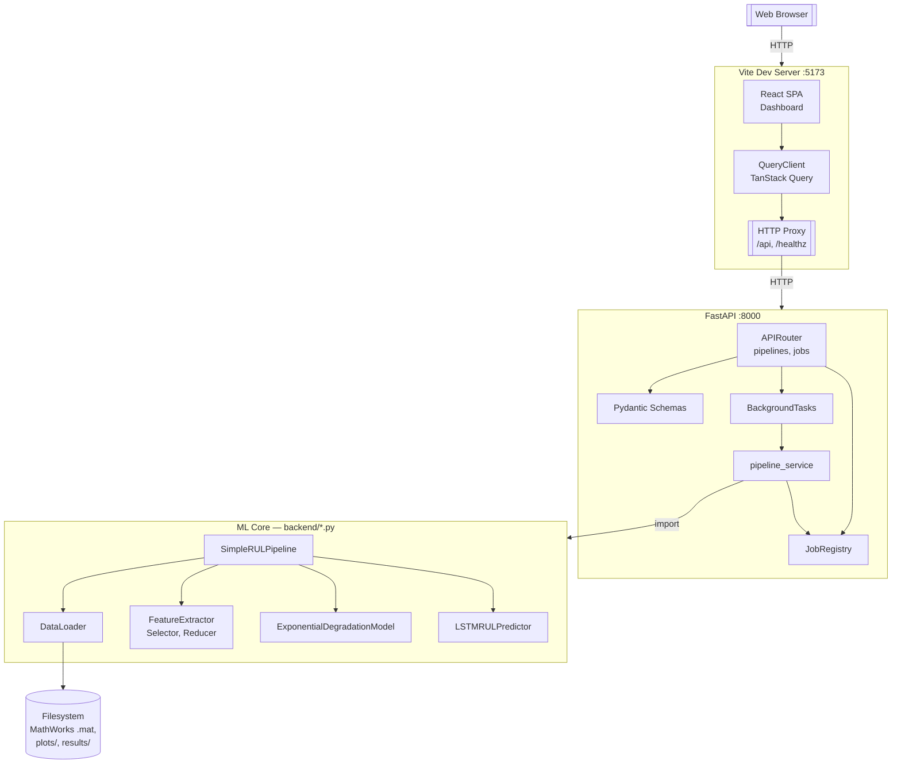
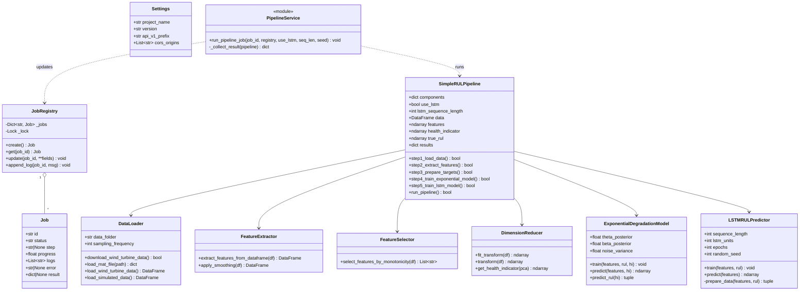
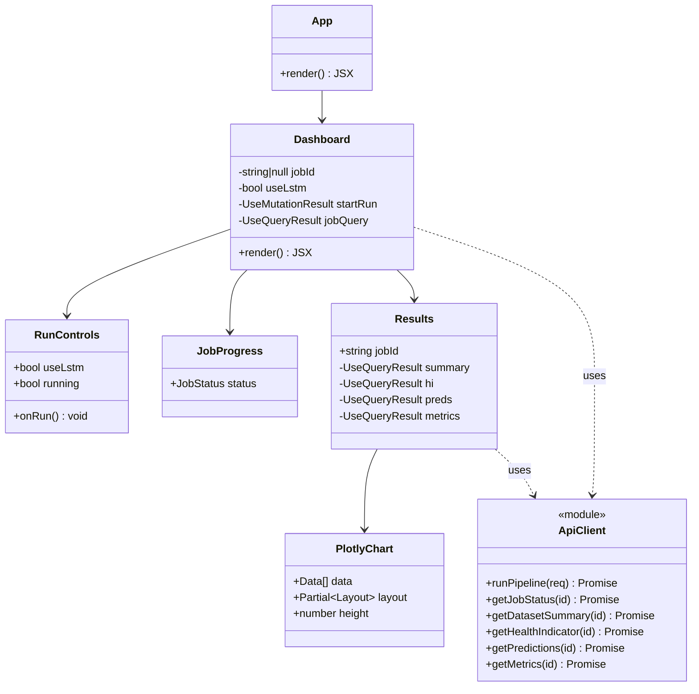
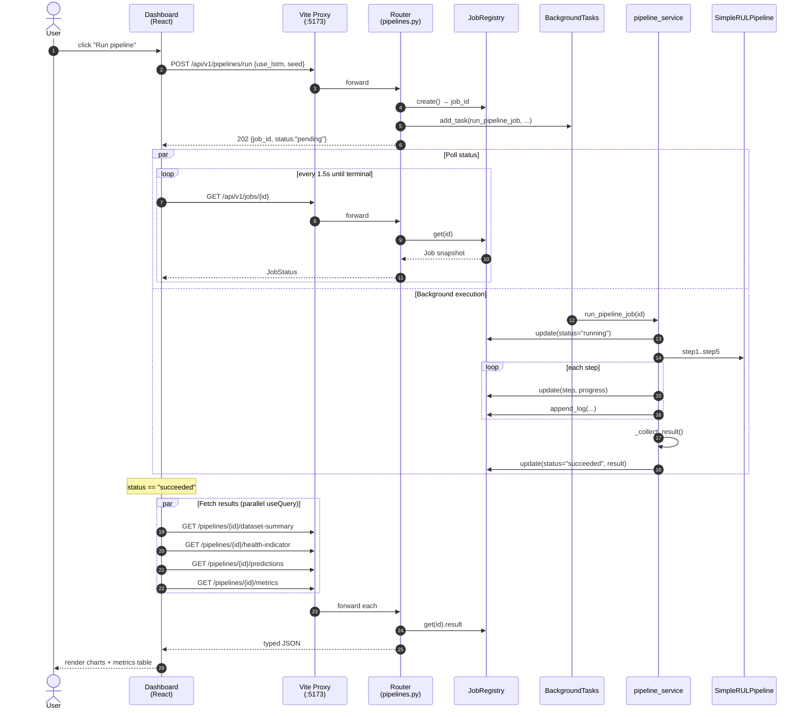
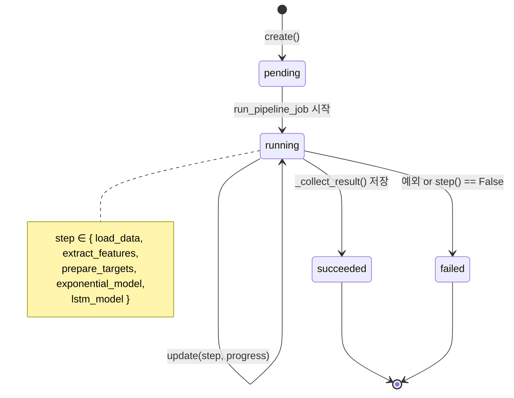
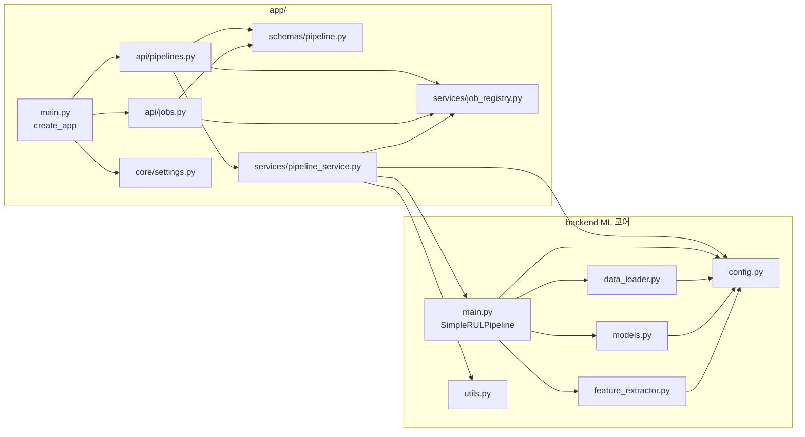

# UML — Wind Turbine RUL Prediction

> 작성일: 2026-04-20
> 렌더링: GitHub 네이티브 Mermaid

아키텍처의 구조·동작·배치를 UML 관점으로 정리한다. 본 문서는
`docs/architecture.md` 의 보완 자료이다.

---

## 1. 컴포넌트 다이어그램

시스템을 구성하는 런타임 단위와 그 의존 관계를 나타낸다.

---

## 2. 백엔드 클래스 다이어그램

FastAPI 어댑터와 ML 코어의 주요 클래스. 역할별로 패키지가 명확히 분리된다.

---

## 3. 프론트엔드 컴포넌트 트리

리액트 컴포넌트와 데이터 소스의 관계.

---

## 4. 시퀀스 다이어그램 — 파이프라인 실행

"Run pipeline" 버튼부터 결과 렌더까지의 메시지 흐름.

---

## 5. 상태 다이어그램 — Job 생명주기

`JobRegistry` 가 추적하는 단일 Job 의 상태 전이.

---

## 6. 패키지 / 모듈 의존성

상위 레벨 import 방향. 화살표는 "import 함"을 의미한다.

> 규칙: `app/` 은 ML 코어에 의존하지만 역방향은 없다. ML 코어만 따로 떼어
> CLI(`python main.py`) 또는 다른 프런트(Streamlit, CLI 툴) 에서도 재사용 가능.
